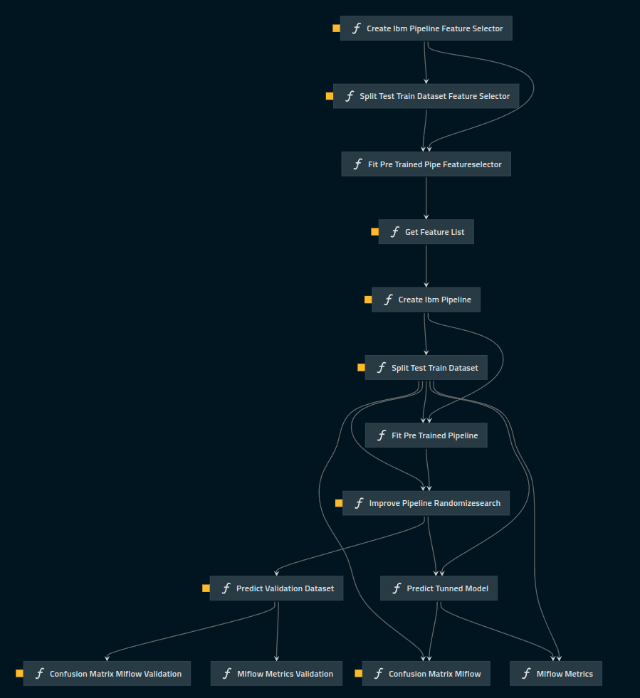

# challenge_ml

## Index 
* [Overview](#overview)

<h1 align="center">Challenge ML</h1>

## Please if you'vent read  (README), please go back and follow the stpes to install and undertanding how Kedro Works

## Objectives


* Minimize the costs from a company with Maintance
* Build a scalable machine learning model with integrated and open tested pipelines using Kedro


## Data
 
The data is Split in Validation Dataset (2020) and Train Dataset (Pre 2020)·
All columns for bureaucratic reasons are coded.  For this reason any AED would’nt be so useful to  undertand the  problema.
Caracteristcis columns:

* 171 Columnas ( type: ‘Object’)
* 1 Feature Target ( Column: ‘class’)
*  170 Feature Training (insted missing value, has a string ‘na’ )


## Strategy 
This is a classic classification  problem, where the costs of pos-maintance are expensive then pre-mantaince where recall metric is the fit for the problem. So was create a cost function that need be minimize.
How our data is non-balance data (98% - negative - 2% - pos) i used undersample technique to keep the caracteristics of ‘pos’ samples.


### Pipelines


* Feature Selection
* Classifier ML
* Validation Results


 
 
## Feature Selection

As coded columns and an analysis of them difficult to interpret, it was created a pipeline to find the best features that will be use the classifier_ml.
4 Steps to complet all the  imblearn.pipeline.

* https://imbalanced-learn.org/stable/references/pipeline.html#module-imblearn.pipeline

Preprocessing:
*    1- ReplaceStr - Replace ‘na’ to np.Nan (missing Values).  
*    2- CastFeature - Transform columns object to Float
*    3- Imputer - Replace missing values (np.Nan) by the medium.

UnderSample
* RandomUnderSampler -  How our data is non-balance data (98% - negative - 2% - pos), i used undersample tecicnique to mantein the caracteristics of ‘pos’ samples.

* https://imbalanced-learn.org/stable/references/generated/imblearn.under_sampling.RandomUnderSampler.html


SequentialFeatureSelector
* To deal with so many features, was used SequentialFeatureSelector and RandomForest, to find the best features. Was used randomforest because bootstrap method would deal well with the probleam. (Many coluns coded ). 
*  https://scikit-learn.org/stable/modules/generated/sklearn.feature_selection.SequentialFeatureSelector.html

Output - Feature Selection:

* It's list with 10 best features. 

## Classifier ML

Preprocessing: Sabe from Feature Selection.

Feature Engineering:
* PolynomialFeatures() -> Now having 10 columns it's possible create new features. 

https://scikit-learn.org/stable/modules/generated/sklearn.preprocessing.PolynomialFeatures.html

GradientBoostingClassifier
* Now having good features, was used a greedy model to find the best classification model.
* RandomizeSearch will use a cost funcion to be minimize.


## Validation Results
Will use the trained_tuned_model from classifier ML to predict the Data from (data_2020, in catalog.)
The resulst are in Mlflow

## Pipelines Description.
[Pipelines Description Docs](src/challenge_ml/README.md)

## Overview

This is your new Kedro project, which was generated using `Kedro 0.18.0`.

Take a look at the [Kedro documentation](https://kedro.readthedocs.io) to get started.

## Rules and guidelines

In order to get the best out of the template:

* Don't remove any lines from the `.gitignore` file we provide
* Make sure your results can be reproduced by following a [data engineering convention](https://kedro.readthedocs.io/en/stable/faq/faq.html#what-is-data-engineering-convention)
* Don't commit data to your repository
* Don't commit any credentials or your local configuration to your repository. Keep all your credentials and local configuration in `conf/local/`

## How to install dependencies

Declare any dependencies in `src/requirements.txt` for `pip` installation and `src/environment.yml` for `conda` installation.

To install them, run:

```
pip install -r src/requirements.txt
```

## How to run your Kedro pipeline

You can run your Kedro project with:

```
kedro run
```

## How to test your Kedro project

Have a look at the file `src/tests/test_run.py` for instructions on how to write your tests. You can run your tests as follows:

```
kedro test
```

To configure the coverage threshold, go to the `.coveragerc` file.

## How to work with Kedro and notebooks

> Note: Using `kedro jupyter` or `kedro ipython` to run your notebook provides these variables in scope: `context`, `catalog`, and `startup_error`.
>
> Jupyter, JupyterLab, and IPython are already included in the project requirements by default, so once you have run `pip install -r src/requirements.txt` you will not need to take any extra steps before you use them.

### Jupyter
To use Jupyter notebooks in your Kedro project, you need to install Jupyter:

```
pip install jupyter
```

After installing Jupyter, you can start a local notebook server:

```
kedro jupyter notebook
```

